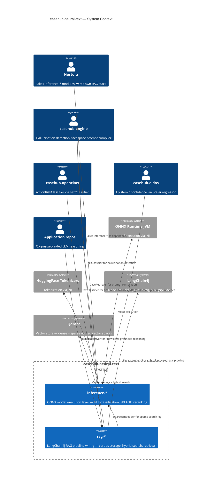
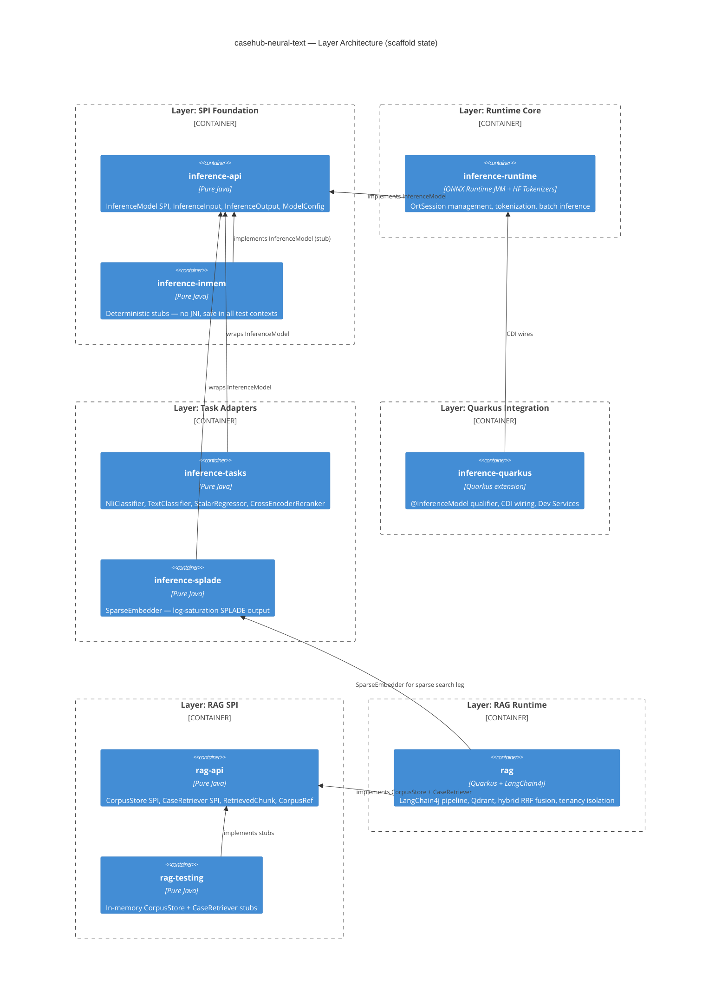
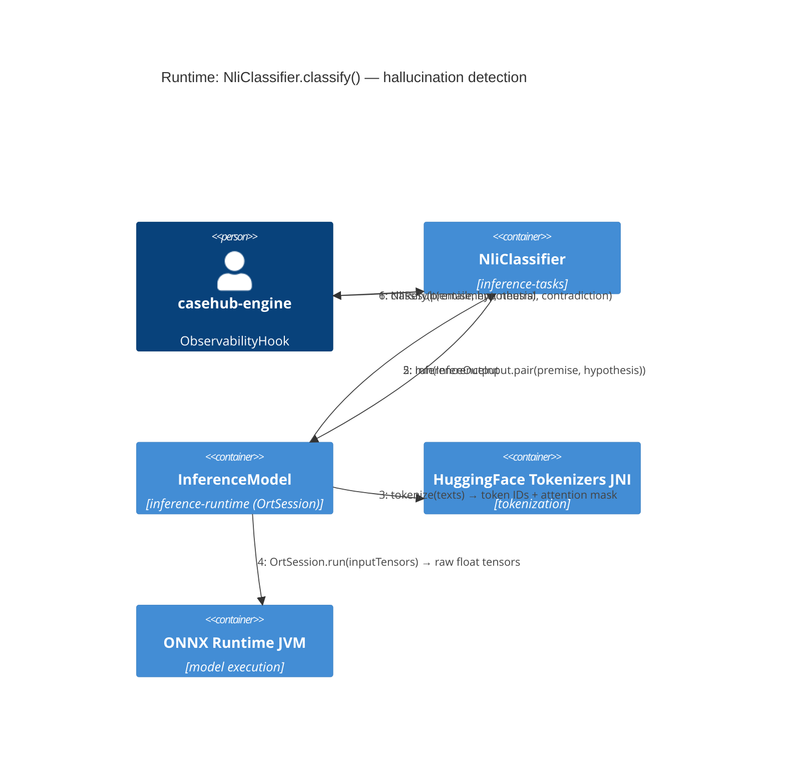
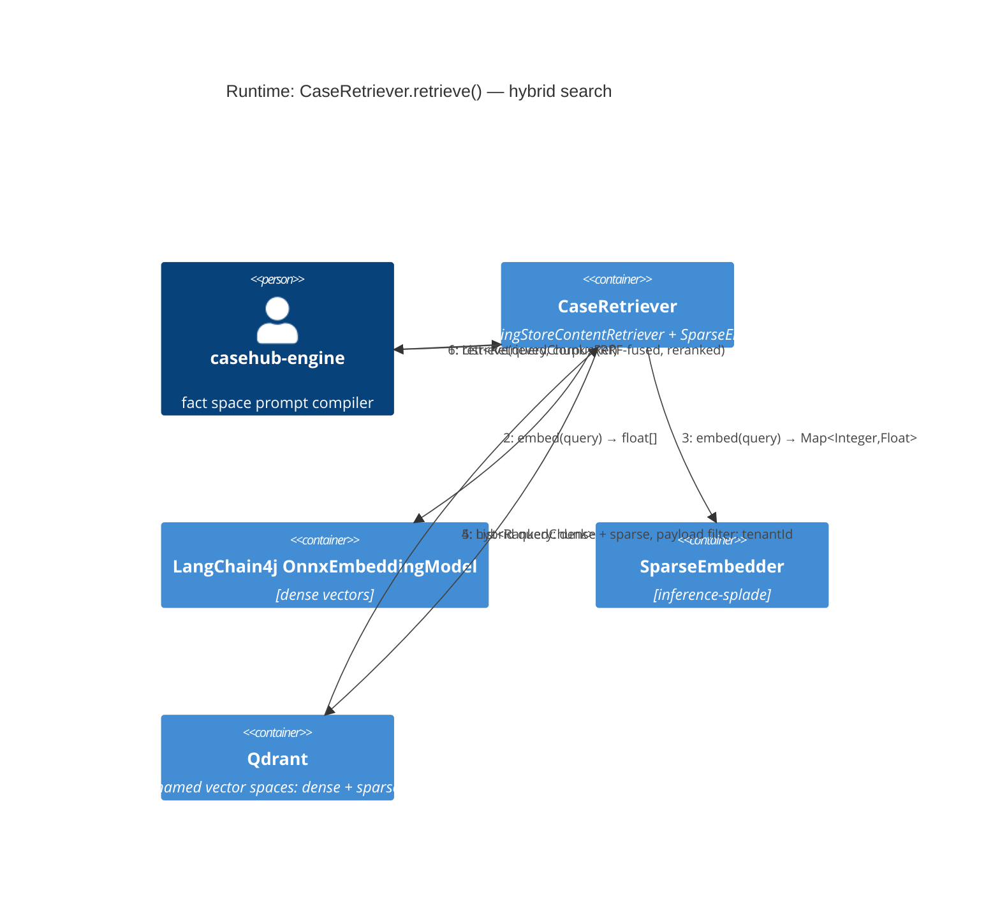
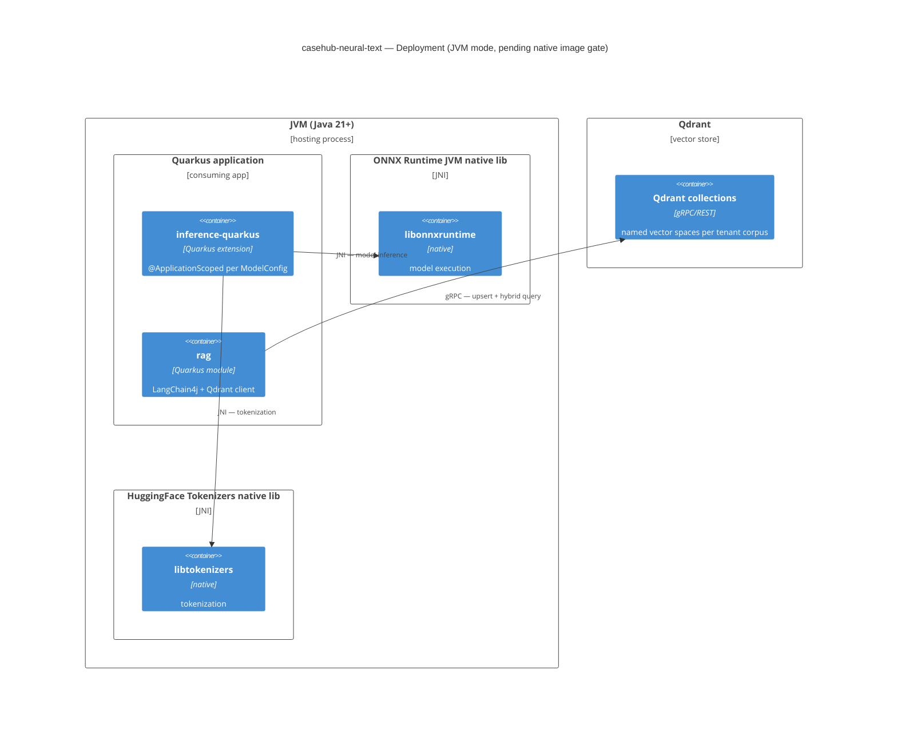
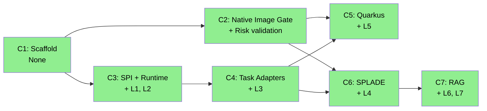

# ARC42STORIES — casehub-neural-text

**Version:** 0.1  
**Status:** All chapters complete (C1–C7) — J1 + J2 ✅  
**Spec:** [arc42stories-spec.md](https://raw.githubusercontent.com/casehubio/parent/main/docs/arc42stories-spec.md)  
**Last updated:** 2026-06-08

---

## §1 Introduction and Goals

`casehub-neural-text` provides two related capabilities:

**Neural Text Inference** — a standalone, general-purpose ONNX model execution layer for JVM projects. Fills the gap LangChain4j leaves: NLI (hallucination detection), classification (action risk), regression (epistemic confidence), SPLADE sparse embeddings, and cross-encoder reranking. Zero casehub domain dependencies in the core modules. Shared with Hortora.

**RAG Integration** — casehub-specific LangChain4j RAG pipeline wiring with tenancy-isolated Qdrant corpus storage, hybrid dense+sparse search via RRF fusion, and `CorpusStore`/`CaseRetriever` SPIs for use by engine case steps and the typed fact space.

### Stakeholders

| Stakeholder | Concern |
|---|---|
| casehub-engine | Hallucination detection hook, fact space prompt compiler via CaseRetriever |
| casehub-openclaw | ActionRiskClassifier SPI implementation via TextClassifier |
| casehub-eidos | Dynamic epistemic domain confidence estimation via ScalarRegressor |
| Hortora | SPLADE sparse embeddings + CrossEncoderReranker — takes inference-* only |
| Application repos (aml, clinical) | Corpus-grounded LLM reasoning via CaseRetriever |

### Top Quality Goals

| Priority | Goal | Scenario |
|---|---|---|
| 1 | **Domain isolation** | `inference-api`, `inference-runtime`, `inference-tasks`, `inference-splade` pass ArchUnit: zero casehub/Quarkus/Spring/LangChain4j deps |
| 2 | **Local inference** | No API call required for any `InferenceModel.run()` — all models run in-process via ONNX Runtime JVM |
| 3 | **Testability without JNI** | `inference-inmem` stubs allow complete unit testing of all task adapters and rag pipeline without loading ONNX Runtime |
| 4 | **Tenancy isolation** | Every `CaseRetriever.retrieve()` is tenancy-scoped; cross-tenant retrieval is blocked at the SPI boundary |

### Artifact Schema

| Artifact type | Format | Example | Where it lives |
|---|---|---|---|
| Issue / epic | `#N` | `#2` | casehubio/neural-text GitHub Issues |
| Parent tracking issue | `parent#N` | `parent#158` | casehubio/parent GitHub Issues |
| Garden entry | `GE-YYYYMMDD-XXXXXX` | `GE-20260530-0dc6de` | `~/.hortora/garden/` |
| Design spec | `YYYY-MM-DD-topic` | `2026-06-03-ai-fusion` | `docs/specs/` |
| Blog entry | `YYYY-MM-DD-title` | `2026-06-04-scaffold` | workspace `blog/` |

---

## §2 Constraints

**Zero domain dependency constraint** — `inference-api`, `inference-runtime`, `inference-tasks`, and `inference-splade` must have zero dependencies on casehub domain artifacts, Quarkus, Spring, or LangChain4j. Enforced by ArchUnit from day one. This constraint exists because Hortora must be able to depend on these modules without importing any casehub runtime.

**Native image gate** — `inference-quarkus` and Hortora's distributable native binary both require ONNX Runtime JNI and HuggingFace Tokenizers JNI to work in Quarkus native image on macOS ARM. This is unproven. Until the prototype (C2) passes, `inference-quarkus` is JVM-only.

**LangChain4j for dense RAG** — dense embeddings and the RAG pipeline use LangChain4j (`OnnxEmbeddingModel`, `DocumentSplitter`, Qdrant `EmbeddingStore`). This is not negotiable — casehub already uses LangChain4j (eidos uses langchain4j-core) and rebuilding the dense pipeline would be duplication.

**Hortora shares inference-* only** — `rag-*` modules are casehub-specific. Hortora wires their own LangChain4j RAG stack independently. No code is shared between the two RAG wiring layers.

**casehub-platform version** — rag/* modules depend on casehub-platform-api for tenancy primitives. Must stay in sync with the platform version pinned in casehub-parent BOM.

---

## §3 Context and Scope



**What is in scope:**
- Running pre-trained ONNX models for text tasks
- casehub RAG pipeline wiring with tenancy isolation and hybrid search
- SPIs for extension and testability

**What is out of scope:**
- Model training or fine-tuning
- Dense embedding for RAG (LangChain4j's responsibility)
- Agent-to-agent messaging (casehub-qhorus)
- Audit ledger (casehub-ledger)
- Case orchestration (casehub-engine)

---

## §4 Solution Strategy

### Core architectural patterns

**SPI layering** — every capability is expressed as a SPI in `inference-api` or `rag-api` (pure Java, zero deps). Implementations live in separate modules. Callers depend only on the SPI; implementations are swapped by adding/removing classpath entries. This enables `inference-inmem` for testing without JNI, and enables Hortora to wire its own implementations.

**Task adapter pattern** — raw ONNX tensor output is never exposed to callers. Typed task adapters (`NliClassifier`, `TextClassifier`, `ScalarRegressor`, `CrossEncoderReranker`) in `inference-tasks` interpret tensor names and post-process outputs into domain types. An LLM calling `NliClassifier.classify("premise", "hypothesis")` receives an `NliResult` with named fields — no knowledge of tensor names required.

**Hybrid RAG** — two vector representations per document: dense (LangChain4j `OnnxEmbeddingModel`) and sparse (SPLADE via `inference-splade`). Both stored in Qdrant named vector spaces. Retrieval uses either or both, fused via RRF. Dense handles semantic similarity; sparse handles lexical precision for regulatory/clinical text.

**Tenancy isolation at the SPI boundary** — `CaseRetriever.retrieve()` and `CorpusStore.ingest()` require a `CorpusRef` carrying the tenant ID. No cross-tenant retrieval is possible through the SPI. Qdrant payload filtering enforces isolation at the storage layer.

### Relationship to LangChain4j

This module sits **below** LangChain4j for inference and **above** LangChain4j for RAG:

| Capability | Where |
|---|---|
| Dense float-vector embeddings | LangChain4j `OnnxEmbeddingModel` |
| Document parsing, chunking, retrieval pipeline | LangChain4j |
| Sparse SPLADE embeddings | `inference-splade` (this module) |
| NLI, classification, regression, cross-encoder | `inference-tasks` (this module) |
| casehub RAG wiring, tenancy, hybrid search | `rag-*` (this module) |

### Chapter sequencing rationale

- C2 before C5 and C6: **hard** — native image gate must pass before `inference-quarkus` (C5) or `inference-splade` (C6) commit to native image. If gate fails, C5 and C6 continue in JVM-only mode.
- C3 before C4: **hard** — `inference-tasks` wraps `InferenceModel` from `inference-runtime`; runtime must exist before adapters can be built.
- C4 before C6: **soft** — `inference-splade` follows the same adapter pattern as `inference-tasks`; C4 establishes it.
- C6 before C7: **hard** — `casehub-rag` uses `SparseEmbedder` from `inference-splade` for the sparse search leg.
- C3 and C5 independent: C5 (Quarkus CDI wiring) wraps C3 (runtime), but C3 ships first as a usable JVM-only artifact; C5 adds the Quarkus layer separately.

---

## §5 Building Block View



### Layers

| Layer | Module | Tier | Hortora? |
|---|---|---|---|
| L1 SPI Foundation | `inference-api`, `inference-inmem` | Pure Java, zero deps | ✅ yes |
| L2 Runtime Core | `inference-runtime` | ONNX Runtime JVM + HF Tokenizers JNI | ✅ yes |
| L3 Task Adapters | `inference-tasks` | Pure Java | ✅ yes |
| L4 Sparse Embeddings | `inference-splade` | Pure Java | ✅ yes |
| L5 Quarkus Integration | `inference-quarkus` | Quarkus extension | casehub only |
| L6 RAG SPI | `rag-api`, `rag-testing` | Pure Java, zero deps | casehub only |
| L7 RAG Runtime | `rag` | Quarkus + LangChain4j | casehub only |

---

## §6 Runtime View

### Inference flow (NLI example — hallucination detection)



### RAG retrieval flow



---

## §7 Deployment View



**Native image:** conditional on C2 prototype. Both JNI layers must work in a Quarkus native image binary on macOS ARM before `inference-quarkus` switches to native mode. Until then, JVM mode only.

---

## §8 Crosscutting Concepts

### Domain isolation enforcement

All `inference-*` modules (except `inference-quarkus`) and `rag-api` enforce zero external domain dependencies via ArchUnit. This is the single most critical architectural constraint. Violation breaks Hortora's dependency contract without compile-time error.

```java
// Example ArchUnit rule (inference-api)
noClasses().that().resideInAPackage("io.casehub.inference..")
    .should().dependOnClassesThat()
    .resideInAnyPackage("io.casehub..", "io.quarkus..", "org.springframework..", "dev.langchain4j..")
    .check(importedClasses);
```

### JNI lifecycle

`OrtSession` is thread-safe for concurrent inference. Model loading (file I/O + native heap allocation) is expensive — one session per `ModelConfig`, loaded once at startup and held for the process lifetime. In `inference-quarkus`, each configured model is an `@ApplicationScoped` CDI bean. Never create sessions per-request.

### Tenancy isolation

`CorpusRef` carries `tenantId`. `CaseRetriever.retrieve()` passes tenant ID as a Qdrant payload filter on every query. No cross-tenant retrieval is possible through the SPI. Cross-tenant access requires a separate `@CrossTenant`-qualified bean (not yet defined — file issue when needed).

### Testing without JNI

`inference-inmem` provides deterministic `InferenceModel` stubs: fixed outputs, configurable per test, no JNI, no native libs. All task adapters and rag pipeline components are testable without loading ONNX Runtime. This is mandatory — CI must not require model files or native libraries.

### Anti-patterns

**Exposing tensors to callers** — `Symptom:` callers reference tensor names like `"logits"` or `"last_hidden_state"` directly. `Cause:` task adapter layer bypassed. `Fix:` all tensor interpretation lives in `inference-tasks`; callers receive domain types.

**Session per request** — `Symptom:` inference is slow and memory grows. `Cause:` `OrtEnvironment.createSession()` called in request scope. `Fix:` `@ApplicationScoped` CDI bean; one session per model config.

**Domain types in inference-api** — `Symptom:` ArchUnit fails on Hortora's build. `Cause:` `InferenceInput` or `ModelConfig` references casehub domain types. `Fix:` only `java.*` and `java.util.*` in `inference-api`; domain mapping in adapters.

**Single Qdrant collection for all tenants** — `Symptom:` tenant A's retrieval returns tenant B's documents. `Cause:` payload filter missing or per-tenant collection not used. `Fix:` CorpusRef carries tenantId; Qdrant query always includes `filter: {must: [{key: "tenantId", match: {value: tenantId}}]}`.

**Using LangChain4j OnnxEmbeddingModel for SPLADE** — `Symptom:` sparse embeddings are dense float[] instead of `Map<Integer,Float>`. `Cause:` LangChain4j's `OnnxEmbeddingModel` is dense-only. `Fix:` SPLADE goes through `inference-splade` `SparseEmbedder`, not LangChain4j.

---

## §9 Journeys and Chapters

### §9.1 Journey Overview

| Journey | Description | Chapters | Status |
|---|---|---|---|
| J1 Neural Inference | Deliver the standalone ONNX inference layer — SPI, runtime, adapters, SPLADE, Quarkus wiring | C1–C6 | ✅ Complete |
| J2 RAG Integration | Deliver casehub-specific LangChain4j RAG pipeline with hybrid search | C7 | ✅ Complete |

### §9.2 Chapter Index



| # | Chapter | Journey | Layers touched | Delta summary | Status |
|---|---|---|---|---|---|
| 1 | Scaffold | J1 | — | None | ✅ |
| 2 | Native Image Gate | J1 | (cross-cutting) | Risk validation | ✅ |
| 3 | SPI Foundation + Runtime Core | J1 | L1, L2 | High, High | ✅ |
| 4 | Task Adapters | J1 | L3 | High | ✅ |
| 5 | Quarkus Integration | J1 | L5 | High | ✅ |
| 6 | Sparse Embeddings (SPLADE) | J1 | L4 | High | ✅ |
| 7 | RAG Pipeline | J2 | L6, L7 | High, High | ✅ |

**Layer × Chapter matrix**

| Layer | C1 | C2 | C3 | C4 | C5 | C6 | C7 |
|---|---|---|---|---|---|---|---|
| L1 SPI Foundation | — | — | High | — | — | — | — |
| L2 Runtime Core | — | Low* | High | — | — | — | — |
| L3 Task Adapters | — | — | — | High | — | — | — |
| L4 Sparse Embeddings | — | — | — | — | — | High | Low |
| L5 Quarkus Integration | — | — | — | — | High | — | — |
| L6 RAG SPI | — | — | — | — | — | — | High |
| L7 RAG Runtime | — | — | — | — | — | — | High |

*C2 validates L2's JNI stack in native image; L2 itself is not built until C3.

### §9.3 Chapter Entries

---

#### Chapter 1 — Scaffold

**Journey:** J1 | **Sequence:** 1 of 7 | **Status:** ✅ Complete  
**Delivered:** 2026-06-04 | **Issues:** #1

**What this delivers**  
Repository exists with CLAUDE.md, CI workflow, LAYER-LOG.md, and ARC42STORIES.MD. The ecosystem recognises the repo: it appears in PLATFORM.md, build dashboards, casehubio.github.io, and the incremental build. No inference code or RAG code.

**Accountability gaps closed**  
None — this is infrastructure only.

**Layer Impact**

| Layer | Delta |
|---|---|
| (none) | — |

---

#### Chapter 2 — Native Image Gate

**Journey:** J1 | **Sequence:** 2 of 7 | **Status:** ✅ Complete  
**Delivered:** 2026-06-06 | **Issues:** #2

**What this delivers**  
A passing prototype: ONNX Runtime JNI + HuggingFace Tokenizers JNI both load and execute a real ONNX model inside a Quarkus native image binary on macOS ARM. This is a binary pass/fail gate — either both JNI layers work natively or they do not.

**Accountability gaps closed**  
- Native deployment commitment → confirmed or deferred

**Layer Impact**

| Layer | Delta |
|---|---|
| L2 Runtime Core | Low (validation only — no production code) |

**Note:** If prototype fails, C5 (Quarkus CDI wiring) proceeds in JVM-only mode. Hortora's distributable native binary goal is deferred pending alternative options (JVM + CDS, sidecar process).

---

#### Chapter 3 — SPI Foundation + Runtime Core

**Journey:** J1 | **Sequence:** 3 of 7 | **Status:** ✅ Complete  
**Delivered:** 2026-06-07 | **Issues:** #3 | **Blocked by:** — (independent of C2)

**What this delivers**  
`inference-api` and `inference-runtime` are published artifacts. Any JVM project (casehub or Hortora) can depend on `casehub-inference-api` and `casehub-inference-runtime` and execute ONNX model inference. `inference-inmem` stubs are available for testing without JNI.

**Accountability gaps closed**  
- ArchUnit zero-domain-dep constraint → enforced from this chapter forward

**Layer Impact**

| Layer | Delta |
|---|---|
| L1 SPI Foundation | High |
| L2 Runtime Core | High |

---

#### Chapter 4 — Task Adapters

**Journey:** J1 | **Sequence:** 4 of 7 | **Status:** ✅ Complete  
**Delivered:** 2026-06-07 | **Issues:** #4 | **Blocked by:** C3

**What this delivers**  
`inference-tasks` published with all four typed adapters. casehub-engine can integrate `NliClassifier` for hallucination detection. casehub-openclaw can integrate `TextClassifier` for `ActionRiskClassifier`. casehub-eidos can integrate `ScalarRegressor` for epistemic confidence. Hortora can integrate `CrossEncoderReranker` for precision-mode reranking.

**Accountability gaps closed**  
- Hallucination detection hook → NliClassifier available
- ActionRiskClassifier stub → TextClassifier available

**Layer Impact**

| Layer | Delta |
|---|---|
| L3 Task Adapters | High |

---

#### Chapter 5 — Quarkus Integration

**Journey:** J1 | **Sequence:** 5 of 7 | **Status:** ✅ Done  
**Issues:** #5 | **Blocked by:** C3, C4; conditional on C2 for native image

**What this delivers**  
`inference-quarkus` published. Quarkus applications configure ONNX models via `application.properties` and inject them with `@Inference("name")`. `@QuarkusTest` uses `inference-inmem` stubs via `@Alternative` test producers overriding the `@DefaultBean` production producer.

**Accountability gaps closed**  
- Quarkus-native model configuration → CDI-managed model lifecycle

**Layer Impact**

| Layer | Delta |
|---|---|
| L5 Quarkus Integration | High |

---

#### Chapter 6 — Sparse Embeddings (SPLADE)

**Journey:** J1 | **Sequence:** 6 of 7 | **Status:** ✅ Done  
**Issues:** #6 | **Blocked by:** C2 (ONNX native image validation), C4 (adapter pattern established)

**What this delivers**  
`inference-splade` published. `SparseEmbedder` produces log-saturated sparse term weight maps from SPLADE models. The sparse leg of casehub-rag's hybrid search is now available. Hortora can use `SparseEmbedder` for their Qdrant hybrid search. Candidate for upstream LangChain4j contribution (#1600).

**Accountability gaps closed**  
- Hybrid search sparse leg → SparseEmbedder available

**Layer Impact**

| Layer | Delta |
|---|---|
| L4 Sparse Embeddings | High |

---

#### Chapter 7 — RAG Pipeline

**Journey:** J2 | **Sequence:** 7 of 7 | **Status:** ✅ Complete  
**Issues:** #7 | **Blocked by:** C6 (SparseEmbedder for sparse search leg)

**What this delivers**  
`rag-api`, `rag`, `rag-tika`, and `rag-testing` published. casehub application repos can define named corpora in configuration, ingest documents via `CorpusStore`, and retrieve grounded context via `CaseRetriever`. Hybrid dense+sparse search operates across tenancy-isolated Qdrant collections. `rag-tika` provides optional Apache Tika document parsing → chunked `ChunkInput`. The fact space prompt compiler in casehub-engine can inject retrieved context into LLM worker prompts.

**Accountability gaps closed**  
- Knowledge-grounded LLM reasoning → CaseRetriever available for engine case steps

**Layer Impact**

| Layer | Delta |
|---|---|
| L4 Sparse Embeddings | Low (consumed, not extended) |
| L6 RAG SPI | High |
| L7 RAG Runtime | High |

---

### §9.4 Layer Entries

---

#### Layer L1 — SPI Foundation

**Participates in chapters:** C3  
**Architectural patterns:** Hexagonal (Ports and Adapters), SPI Registry  
**Key protocols:** `module-tier-structure.md` (pure Java, zero deps), `spi-default-method-contract-test.md`  
**Design refs:** `docs/specs/2026-06-03-standalone-rag-retrieval-brief.md`, `Hortora/spec: docs/superpowers/specs/2026-06-03-onnx-inference-module-design.md`  
**Issues:** #3 | parent#158  
**Completed:** ✅

#### What it adds

Defines the contract between callers and ONNX model execution. Before this layer: no shared type language between casehub modules, Hortora, and ONNX Runtime. After: all parties agree on `InferenceModel`, `InferenceInput`, `InferenceOutput`, and `ModelConfig`. Implementations (real ONNX, in-memory stubs) are substituted at the CDI or classpath level.

#### Accountability gaps closed

| Gap | What breaks without it | Closed by |
|---|---|---|
| Hortora dependency contract | Hortora forced to depend on casehub domain types | Zero-dep `inference-api` — ArchUnit enforced |
| Testability without JNI | Unit tests require ONNX Runtime native libs | `inference-inmem` stubs implement `InferenceModel` |

#### Key files

| File | Role |
|---|---|
| `inference-api/.../InferenceModel.java` | SPI interface — `run()`, `runBatch()`, `outputSize()`, `close()` |
| `inference-api/.../InferenceInput.java` | Record — `List<String> texts`, factories `of()` and `pair()` |
| `inference-api/.../InferenceOutput.java` | Record — `float[] values` with value-based equality |
| `inference-api/.../InferenceException.java` | Unchecked exception for inference failures |
| `inference-inmem/.../InMemoryInferenceModel.java` | Deterministic stub — `returning()` and `withFunction()` factories |
| `inference-api/.../DependencyConstraintTest.java` | ArchUnit — blocks Quarkus, Spring, LangChain4j, ONNX Runtime, DJL |

#### Key wiring

`InferenceModel` extends `AutoCloseable`. `close()` must not throw — contract specifies silent cleanup. `runBatch()` has a default implementation that delegates to `run()` sequentially; `OnnxInferenceModel` overrides with a true batched implementation. `outputSize()` returns `OptionalInt` — models that don't know their output size at construction time return empty.

`InMemoryInferenceModel.returning(float...)` returns the same values for every input — simplest stub. `InMemoryInferenceModel.withFunction(int, Function<InferenceInput, float[]>)` allows input-dependent responses for adapter tests.

#### Architectural decisions

`InferenceInput` uses `List<String> texts` only — tokenization is the runtime's responsibility, not the caller's. Callers never touch token IDs or attention masks. This keeps the SPI portable across tokenizer versions and model families.

`InferenceOutput` simplified to `float[] values` (design departure from Hortora spec which proposed `Map<String, float[]>` keyed by tensor name). Single-output models are the dominant case; named tensors add complexity for no benefit at the SPI boundary. Task adapters know the output structure of their models.

`InferenceInput` capped at max 2 texts (design departure). NLI requires exactly 2 (premise + hypothesis); single-text tasks require 1. No known task requires 3+ texts in a single input. Enforced by the `InferenceInput` constructor.

`ModelConfig` placed in `inference-runtime` not `inference-api` (design departure). Config carries runtime-specific concerns (thread counts, sequence length) that don't belong in the zero-dep SPI.

#### Pattern introduced
`InferenceModel` SPI — thin contract over any ONNX model; stubs via `inference-inmem`; implementations via `inference-runtime`; typed interpretation via `inference-tasks`.

#### Pattern anchor
`inference-api/src/main/java/io/casehub/inference/InferenceModel.java`, `inference-api/src/main/java/io/casehub/inference/InferenceInput.java`

#### Gotchas
- `Objects.requireNonNull` throws NPE, not IAE — SPI contracts that specify "throws IAE for null" need explicit null checks (GE-20260607-db04c6)
- Sequential try-catch for `close()` with multiple resources — must not let first failure prevent closing remaining resources (GE-20260607-9cef08)

#### Pattern to replicate
ArchUnit `DependencyConstraintTest` per module — blocks Quarkus, Spring, LangChain4j, ONNX Runtime, DJL. Copy this test into every new `inference-*` module. The constraint list in each module should match its tier — `inference-api` blocks everything; `inference-runtime` allows ONNX Runtime and DJL but blocks Quarkus/Spring/LangChain4j.

---

#### Layer L2 — Runtime Core

**Participates in chapters:** C2 (validation), C3 (implementation)  
**Architectural patterns:** Session Pool (one session per ModelConfig, singleton lifetime)  
**Design refs:** `docs/specs/2026-06-03-standalone-rag-retrieval-brief.md` §Native Image Gate  
**Issues:** #2, #3 | parent#158  
**Completed:** ✅

#### What it adds

Bridges the JVM world and ONNX Runtime JNI. Before this layer: ONNX models cannot be executed from JVM code without platform-specific native library setup. After: text can be tokenized via HuggingFace Tokenizers JNI and passed to an ONNX Runtime session; raw float tensors are returned as `InferenceOutput`.

#### Accountability gaps closed

| Gap | What breaks without it | Closed by |
|---|---|---|
| Local model execution | Every inference requires an LLM API call | `inference-runtime` executes models in-process via JNI |
| Air-gapped deployment | Regulated deployments (clinical, AML) cannot call external APIs | ONNX Runtime runs locally; no network required |

#### Key files

| File | Role |
|---|---|
| `inference-runtime/.../OnnxInferenceModel.java` | `InferenceModel` impl — wraps `OrtSession` + `HuggingFaceTokenizer` |
| `inference-runtime/.../ModelConfig.java` | Record — `modelPath`, `tokenizerPath`, `maxSequenceLength`, thread counts |
| `inference-runtime/.../ModelLoadException.java` | Unchecked exception for model/tokenizer loading failures |

#### Key wiring

`OnnxInferenceModel` constructor takes `ModelConfig` and eagerly loads both the ONNX model (`OrtSession`) and tokenizer (`HuggingFaceTokenizer`). Validation: model file must exist, tokenizer file must exist, model must have at least one input/output node.

`OrtSession` is thread-safe for concurrent inference — do not create a new session per request. One session per `ModelConfig`, loaded at startup, held for process lifetime. In `inference-quarkus`, each model config becomes an `@ApplicationScoped` CDI bean.

`close()` uses sequential try-catch: session closed first, then environment, then tokenizer. Each close is independent — failure of one does not prevent the others.

DJL `HuggingFaceTokenizer` used instead of the HuggingFace Tokenizers JNI directly (design departure from C2). DJL wraps the same Rust JNI layer but provides a cleaner Java API and Maven-published native libs.

#### Architectural decisions

Two JNI layers (ONNX Runtime + DJL Tokenizers) are required rather than one. ONNX Runtime handles model execution; DJL HuggingFace Tokenizers handles tokenization. Alternative (LangChain4j tokenization) rejected — LangChain4j tokenizers are dense-embedding-specific and do not produce token ID + attention mask tensors needed for arbitrary ONNX model input.

`outputSize` auto-detected from the ONNX model's output metadata when the shape is statically known; returned as `OptionalInt.empty()` when the model has dynamic output dimensions (design departure — spec proposed mandatory int).

#### Gotchas
- C2 native image gotchas: `inference-quarkus/src/main/resources/NATIVE-IMAGE-NOTES.md` — 3 entries (GE-20260606-d3cd87, GE-20260606-7bf5dd, GE-20260606-025601)
- C3 runtime gotchas: requireNonNull NPE vs IAE (GE-20260607-db04c6), sequential try-catch close (GE-20260607-9cef08)

#### Pattern to replicate
`OnnxInferenceModel` constructor pattern: validate config → load model → validate model structure → load tokenizer → detect output size. Any failure during construction throws `ModelLoadException` and cleans up already-allocated resources. This eager-validate-or-fail pattern should be replicated in any future `InferenceModel` implementation.

---

#### Layer L3 — Task Adapters

**Participates in chapters:** C4  
**Architectural patterns:** Adapter (wraps InferenceModel; exposes domain types)  
**Issues:** #4 | parent#158  
**Completed:** ✅

#### What it adds

Callers interact with domain types, never raw tensors. `NliClassifier` interprets the `logits` tensor as entailment/neutral/contradiction scores. `TextClassifier` interprets softmax output as label + confidence. `ScalarRegressor` reads a scalar output tensor. `CrossEncoderReranker` ranks candidate texts by relevance to a query. All four wrap any `InferenceModel` — tests inject `inference-inmem` stubs.

#### Key files

| File | Role |
|---|---|
| `inference-tasks/.../NliClassifier.java` | Adapter — convention + explicit-index constructors, softmax, runtime guard |
| `inference-tasks/.../NliLabel.java` | Enum — ENTAILMENT, NEUTRAL, CONTRADICTION |
| `inference-tasks/.../NliResult.java` | Record — entailment/neutral/contradiction + `predicted()` + `scores()` |
| `inference-tasks/.../TextClassifier.java` | Adapter — labels at construction, softmax, `classify()` → `ClassificationResult` |
| `inference-tasks/.../ClassificationResult.java` | Record — label, confidence, scores (Map.copyOf) |
| `inference-tasks/.../ScalarRegressor.java` | Adapter — raw scalar output, `predict()` → float |
| `inference-tasks/.../CrossEncoderReranker.java` | Adapter — `score()` + batch `rerank()` via `runBatch()` |
| `inference-tasks/.../RankedResult.java` | Record — text, score, originalIndex |
| `inference-tasks/.../Softmax.java` | Package-private — numerically stable softmax utility |
| `inference-tasks/.../DependencyConstraintTest.java` | ArchUnit — framework + casehub domain exclusion (new `DescribedPredicate` rule) |

#### Architectural decisions

Each adapter is constructed with an `InferenceModel` dependency (injected or passed directly). Adapters are **not AutoCloseable** — they do not own the model. This makes adapters independently testable without Quarkus or JNI, and prevents double-close bugs when multiple adapters share a model. Quarkus wiring (`@InferenceModel` qualifier) is in L5 — adapters do not know about CDI.

`NliClassifier` has two constructors: convention (HuggingFace standard order 0=contradiction, 1=neutral, 2=entailment) and explicit-index (for non-standard models). `TextClassifier` fallback was rejected for non-standard NLI models — it returns `ClassificationResult`, not `NliResult`, losing the typed three-way distribution.

All adapters validate `model.outputSize()` at construction (fail-fast) and validate `values.length` at runtime (defence-in-depth). Softmax is a package-private utility class shared by NliClassifier and TextClassifier — zero public API surface.

SPLADE output is not an adapter in `inference-tasks` — it is a separate module (`inference-splade`, L4) because its post-processing (log-saturation, sparse map output) is distinct from the classifier/regressor/reranker pattern and because Hortora may want `inference-splade` independently without `inference-tasks`.

#### Gotchas

- Adapter null-arg validation must precede `InferenceInput.of()`/`.pair()` construction — otherwise callers get `NullPointerException` from `Objects.requireNonNull` in the factory instead of `IllegalArgumentException` with an adapter-specific message
- `ClassificationResult` compact constructor must use `Map.copyOf()` — records with Map fields need defensive copies to maintain immutability
- ArchUnit casehub domain exclusion requires `DescribedPredicate.describe()` with a lambda checking `getPackageName()` — the existing `resideInAnyPackage()` pattern cannot express "allow io.casehub.inference but block all other io.casehub" (backport tracked as #10)

#### Pattern to replicate

Adapter construction pattern: validate null model → validate `outputSize()` when present → store model. Method pattern: validate null args (IAE with adapter-specific message) → `model.run(InferenceInput.of/pair(...))` → extract `values()` exactly once → validate `values.length` (InferenceException) → interpret. This two-layer validation (construction + runtime) should be replicated in any future adapter including `SparseEmbedder` (C6).

---

#### Layer L4 — Sparse Embeddings (SPLADE)

**Participates in chapters:** C6, C7  
**Architectural patterns:** Adapter (wraps InferenceModel; post-processes to sparse format)  
**Design refs:** `docs/specs/2026-06-03-standalone-rag-retrieval-brief.md` §SPLADE  
**Issues:** #6 | parent#158  
**Completed:** ✅

#### What it adds

Produces sparse term weight maps (`Map<Integer, Float>`) from SPLADE models. Enables the sparse leg of hybrid search — regulatory, clinical, and legal text benefits from SPLADE's lexical precision over dense embeddings. Post-processing: `log(1 + relu(weight))` saturation + threshold filtering (drop weights < 0.01). Output is Qdrant named vector space compatible.

#### Architectural decisions

SPLADE output is `Map<Integer, Float>` not `float[]`. Qdrant named vector spaces store both dense `float[]` (from LangChain4j) and sparse `Map<Integer, Float>` (from `SparseEmbedder`) per document. This hybrid architecture requires Qdrant — pgvector does not natively support named vector spaces for true hybrid search as of 2026-06.

Log-saturation applied before threshold: `log(1 + relu(w))` for each raw weight w. This compresses high-weight terms and prevents dominance by single high-attention tokens. Threshold 0.01 removes noise — empirically established in the SPLADE paper.

Candidate for upstream LangChain4j contribution (issue #1600) once stable.

#### Gotchas

No JNI issues — `SparseEmbedder` is pure Java, depends only on `inference-api`. No native library involvement.

#### Key files

- `inference-splade/src/main/java/io/casehub/inference/splade/SparseEmbedder.java` — single class, embed + embedBatch
- `inference-splade/src/test/java/io/casehub/inference/splade/SparseEmbedderTest.java` — 17 tests
- `inference-splade/src/test/java/io/casehub/inference/splade/DependencyConstraintTest.java` — ArchUnit enforced

#### Pattern to replicate

Same adapter pattern as inference-tasks: constructor takes `InferenceModel`, validates at construction, typed method calls `model.run()` and post-processes. Add ArchUnit `DependencyConstraintTest` with the casehub domain exclusion rule.

---

#### Layer L5 — Quarkus Integration

**Participates in chapters:** C5  
**Architectural patterns:** CDI SPI Registration, `@Qualifier`-based disambiguation  
**Issues:** #5  
**Completed:** ✅

#### What it adds

Quarkus applications declare ONNX models in `application.properties` and inject them with `@Inference("name")`. `InferenceModelProducer` (`@ApplicationScoped @DefaultBean`) creates `OnnxInferenceModel` instances lazily from `@ConfigMapping` properties. `@QuarkusTest` overrides via `@Alternative` test producers returning `InMemoryInferenceModel`.

#### Architectural decisions

`@Inference` qualifier, not `@InferenceModel` — avoids import collision with the `io.casehub.inference.InferenceModel` SPI interface. `@Nonbinding String value()` means CDI treats all `@Inference` qualifiers identically; the producer inspects `InjectionPoint` to resolve the specific model name at runtime.

CDI-only, no Quarkus extension (no deployment/runtime split). Full extension deferred to native image gate. `@DefaultBean` on the production producer means any `@Produces @Inference` method in test code wins automatically.

`reuseForks=false` in surefire — required because the module mixes `@QuarkusTest` (augmented classloader) with plain JUnit tests that load JNI libraries. See GE-20260608-564065.

#### Gotchas

JNI classloader conflict: `@QuarkusTest` loads ONNX Runtime JNI via Quarkus augmented classloader. A plain JUnit test in the same JVM fork tries to reload the same native library via the system classloader — JNI refuses with `UnsatisfiedLinkError: Native Library already loaded in another classloader`. Fix: `reuseForks=false`. Captured in garden: GE-20260608-564065.

#### Key files

- `inference-quarkus/src/main/java/io/casehub/inference/quarkus/Inference.java` — CDI qualifier
- `inference-quarkus/src/main/java/io/casehub/inference/quarkus/InferenceModelConfig.java` — `@ConfigMapping`
- `inference-quarkus/src/main/java/io/casehub/inference/quarkus/InferenceModelProducer.java` — producer + lifecycle

#### Pattern to replicate

For new inference model consumers: inject `@Inference("name") InferenceModel model`. Configure in `application.properties` under `casehub.inference.models.<name>.*`. For tests: provide an `@Alternative @ApplicationScoped` producer class, enable via `QuarkusTestProfile.getEnabledAlternatives()`.

---

#### Layer L6 — RAG SPI

**Participates in chapters:** C7  
**Architectural patterns:** Hexagonal (Ports and Adapters)  
**Issues:** #7, #11 | parent#164  
**Completed:** ✅

#### What it adds

Defines the contract for knowledge corpus management and retrieval within casehub. `CorpusStore` allows application repos to ingest and manage documents scoped to a tenant corpus. `CaseRetriever` provides the retrieval interface for engine case steps and the typed fact space prompt compiler. Reactive variants (`ReactiveCorpusStore`, `ReactiveCaseRetriever`) enable consumers on the Vert.x event loop (e.g. casehub-engine's `CaseContextChangedEventHandler`). Mutiny is `provided` scope — same pattern as casehub-ledger-api and casehub-eidos-api. `rag-testing` stubs make both blocking and reactive interfaces usable in `@QuarkusTest` without Qdrant.

#### Architectural decisions

`CorpusRef` (tenantId + corpusName) is mandatory on all SPI calls — no implicit ambient tenancy. This enforces tenancy isolation at the type level, not just the runtime level.

`CorpusStore` and `CaseRetriever` are separate SPIs. `CorpusStore` is write-oriented (ingest, delete, list). `CaseRetriever` is read-oriented (retrieve). This separation allows different implementations and different CDI beans for admin vs. runtime contexts.

`RetrievedChunk` carries `sourceDocumentId`, `content`, `relevanceScore`, and `metadata`. No per-chunk `embeddingStrategy` field — after RRF fusion, every result is hybrid. The fused score is what matters for ranking; per-leg provenance is not recoverable from the fused result and would be architecturally misleading.

#### Gotchas

Qdrant `Common.Filter` is not `Points.Filter` — the import is `io.qdrant.client.grpc.Common.Filter`, not the Points variant. Using the wrong one compiles but produces empty results at runtime (GE-20260609-521cca).

#### Pattern to replicate

Reactive SPI co-location in Tier 1 api modules with Mutiny `provided` scope — same pattern as casehub-ledger-api and casehub-eidos-api. `@DefaultBean` bridge wraps blocking delegate with `runSubscriptionOn(workerPool)`. In-memory stubs use `@Alternative @Priority(1) @ApplicationScoped` with no `@IfBuildProperty` gate (no Hibernate Reactive dep).

---

#### Layer L7 — RAG Runtime

**Participates in chapters:** C7  
**Architectural patterns:** Pipeline (ingest → chunk → embed → store; query → embed → retrieve → rerank → assemble)  
**Key protocols:** `flyway-extension-migration-registration.md` (no migrations — Qdrant managed externally)  
**Issues:** #7, #11, #13 | parent#164  
**Completed:** ✅

#### What it adds

Implements `CorpusStore` and `CaseRetriever` using LangChain4j `EmbeddingModel` (dense embeddings) + `inference-splade` `SparseEmbedder` (sparse) + Qdrant Java client (gRPC) for hybrid search with RRF fusion. Optional `CrossEncoderReranker` for precision-mode top-N. Configurable tenancy isolation — separate collections per tenant (default) or shared collection with payload filtering. `@DefaultBean` bridges (`BlockingToReactiveCorpusStore`, `BlockingToReactiveCaseRetriever`) wrap blocking implementations with `runSubscriptionOn(workerPool)` for consumers that inject reactive SPIs without native reactive Qdrant impls (#13).

`langchain4j-qdrant` not used — LangChain4j does not support Qdrant named vector spaces or hybrid search ([langchain4j#4994](https://github.com/langchain4j/langchain4j/issues/4994), open, no timeline). Both dense and sparse legs use the Qdrant Java gRPC client directly for unified architecture. LangChain4j used only for `EmbeddingModel`, `DocumentSplitter`, and Tika parser (in `rag-tika`).

#### Architectural decisions

Qdrant chosen over pgvector for the hybrid leg — pgvector does not natively support named vector spaces for true hybrid search.

RRF (Reciprocal Rank Fusion) used to merge dense and sparse result lists. Scores are not comparable across embedding types; rank is. RRF is parameter-free and well-studied. Weighted combination rejected — requires tuning per domain.

`casehub-platform-api` is the only casehub dependency in `rag` — `CurrentPrincipal` and `TenancyConstants` for tenancy isolation. No engine, ledger, or qhorus types.

#### Gotchas

`langchain4j-qdrant` does not support named vector spaces or hybrid search (langchain4j#4994). Must use the Qdrant Java gRPC client directly for both legs. Qdrant client 1.18.1 returns `ListenableFuture`, not `CompletionStage` — needs Guava bridge or `Uni.createFrom().emitter()` for native reactive impls (#13).

#### Pattern to replicate

Unified Qdrant gRPC client for both dense and sparse legs — one client, one code path. `TenancyStrategy` enum for configurable collection isolation. `@DefaultBean` bridges for reactive SPIs that wrap blocking delegates on the worker pool.

---

## §10 Architectural Decisions

*(decisions not captured inline in layer or chapter entries)*

**AD-001 — Single repo for inference-* and rag-*** (2026-06-04)  
inference-* and rag-* are in the same repo (`casehubio/neural-text`). Rationale: rag-* uses `inference-splade` and `CrossEncoderReranker` — they are commonly deployed together in casehub. Hortora ignores `rag-*` by depending only on `inference-*` artifacts. Can be split into separate repos later if Hortora's dependency footprint becomes a concern. Cost of splitting: low (Maven multi-module → separate projects). Cost of premature splitting: one more repo to maintain before any code ships.

**AD-002 — LangChain4j for dense RAG, not a custom implementation** (2026-06-04)  
LangChain4j provides Tika document parsing, chunking, `OnnxEmbeddingModel` (dense ONNX embeddings), and 30+ vector store integrations including Qdrant. Building a parallel implementation would duplicate ~80% of what LangChain4j already does. casehub already uses langchain4j-core (in casehub-eidos). The remaining gap (SPLADE, NLI, classification) is precisely what `casehub-neural-text` adds.

---

## §11 Quality Requirements

| Quality goal | Scenario | Measure |
|---|---|---|
| Domain isolation | Hortora builds against `inference-*` without casehub on classpath | ArchUnit: zero casehub/Quarkus/LangChain4j deps in inference-api, runtime, tasks, splade |
| Testability | All task adapters and rag pipeline unit-testable | 100% test coverage possible without ONNX Runtime native libs via `inference-inmem` |
| Local inference | Hallucination detection runs without API call | `NliClassifier.classify()` returns in <100ms for standard NLI model |
| Tenancy isolation | Tenant A cannot retrieve Tenant B's corpus | Configurable TenancyStrategy: separate Qdrant collections per tenant (default, hard isolation) or shared collection with payload filter on tenantId; enforced by CorpusRef type |

---

## §12 Risks and Technical Debt

| Risk | Probability | Impact | Mitigation |
|---|---|---|---|
| ONNX Runtime JNI fails in Quarkus native image | Medium | High | C2 prototype is mandatory first deliverable; fallback to JVM-only mode documented |
| HuggingFace Tokenizers JNI fails in native image | Medium | High | Same — C2 validates both JNI layers together |
| LangChain4j #4994 (Qdrant hybrid) ships | Low | Low | Unified Qdrant gRPC client used for both legs — no migration needed; evaluate langchain4j-qdrant adoption opportunistically if it simplifies code |
| Hortora's usage pattern conflicts with SPI design | Medium | Medium | Hortora/spec#15 validation required before C3 implementation begins |
| ArchUnit rule drift | Low | High | ArchUnit tests run in CI on every build; fail-fast |

**Technical debt:**
- `CrossEncoderReranker` in `rag` is optional (precision mode) — default path is RRF without reranking; reranking adds latency

---

## §13 Glossary

| Term | Definition |
|---|---|
| ONNX | Open Neural Network Exchange — framework-agnostic format for ML models |
| ONNX Runtime JVM | Microsoft's ONNX Runtime Java bindings — executes ONNX models in the JVM |
| SPLADE | Sparse Lexical and Expansion model — produces sparse term weight maps combining lexical matching with learned expansion |
| NLI | Natural Language Inference — entailment/neutral/contradiction scoring between a premise and hypothesis |
| Cross-encoder | A model that jointly encodes a query + candidate pair and scores their relevance — more accurate than bi-encoder retrieval but slower |
| RRF | Reciprocal Rank Fusion — parameter-free rank-based score merging for combining results from heterogeneous retrieval strategies |
| Named vector spaces | Qdrant feature allowing multiple vector representations per document (e.g. dense + sparse) in separate nameable spaces |
| InferenceModel | The core SPI — wraps any ONNX model session; accepts `InferenceInput`, returns `InferenceOutput` |
| CorpusRef | Carries `tenantId` + `corpusName` — mandatory on all RAG SPI calls; enforces tenancy isolation |
| HuggingFace Tokenizers | Rust-based tokenizer library with JNI bindings — produces token IDs + attention masks from text |
| Native image gate | The C2 prototype that validates both JNI layers work in a Quarkus native image binary on macOS ARM |
