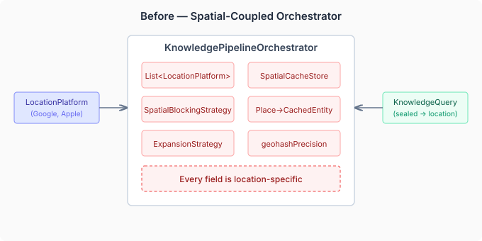
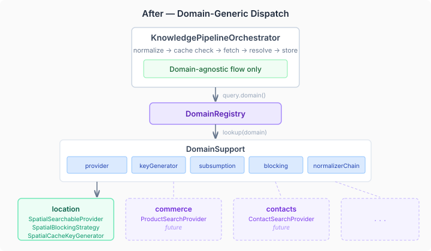

The knowledge pipeline was built to search for places. It worked — cache, dedup, resolution, normalization, promotion to the MindMap graph. But every layer assumed location. The orchestrator took `List<LocationPlatform>`, hardcoded `SpatialBlockingStrategy`, and converted `Place` objects into `CachedEntity` inline. Want to search products? Contacts? Documents? You'd have to fork the orchestrator.

That's what this branch fixes.

## The shape of the problem

I went back to the orchestrator to scope #437 and found it was roughly 50/50: half domain-agnostic flow (cache lookup, subsumption, resolution, storage) and half spatial dispatch (`Place` mapping, `PlaceSearch` calls, geohash key generation). The flow half is genuinely reusable. The dispatch half was strategy implementations masquerading as hardcoded logic.



A previous session had already created the generic SPIs — `CacheStore`, `SearchableProvider`, `BlockingStrategy`, `DomainSupport`, `DomainRegistry`. But nothing was wired. The new types sat unused while the orchestrator still imported `LocationPlatform` and `Place` directly. Abstractions without integration are dead code with better names.

## The extraction

Four sub-issues, each building on the last.

**SpatialSearchableProvider** wraps `LocationPlatform.PlaceSearch` behind the generic `SearchableProvider` interface. The Place-to-CachedEntity conversion — previously embedded in the orchestrator's `search()` method — moves into `toEntity()` on the provider. The orchestrator never sees a `Place` object.

**CDI wiring** makes `DomainRegistry` an `@ApplicationScoped` bean that auto-discovers `DomainSupport` registrations via `Instance<DomainSupport>`. Each domain produces a `@Named` bean bundling its provider, key generator, subsumption rule, blocking strategy, and normalizer chain. The spatial domain registers as `@Named("location")`.

**The orchestrator refactor** is where it comes together. The constructor drops from 13 spatial-specific parameters to 9 domain-agnostic ones. `search()` resolves `DomainSupport` from `query.domain()` and dispatches through the domain's strategy bundle:

```java
DomainSupport domainSupport = domainRegistry.lookup(domain)
    .orElseThrow(() -> new UnsupportedOperationException(
        "No domain registered: " + domain));

Map<String, ExpandedTerm> expansions = normalize(query, domainSupport);
NormalizedQuery normalized = domainSupport.keyGenerator()
    .generate(query, expansions);
```

The cache check, subsumption, fetch, resolution, and storage steps are identical regardless of domain — the only things that change are the strategy implementations plugged in via `DomainSupport`.

**ExpansionStrategy deletion** was the satisfying part. The old class mapped provider IDs to expansion modes. After the refactor, `DomainSupport.normalizerChain()` handles per-domain term expansion — each domain declares exactly the normalizers it needs. The old strategy was 20 lines of code and a config interface, all dead.



## What Claude caught

During code review, Claude flagged a latent NPE: the CDI producer was constructing `SpatialBlockingStrategy(null, 200)`. The `SpatialCacheStore` was available as an injected parameter on a sibling producer method, but nobody had threaded it through to the domain support producer. It would have crashed the first time entity resolution tried blocking on the DomainSupport path — exactly the kind of wiring bug that compiles fine and passes all existing tests because the old code path doesn't trigger it.

## What's left undone

Two acceptance criteria on the orchestrator refactor are intentionally deferred. `refreshStale()` still takes `List<LocationPlatform>` for detail refresh — generalizing that needs a `RefreshStrategy` SPI, which is a separate concern. And `promote()` still delegates to `EntityPromoter` directly rather than routing through a per-domain promotion strategy. Both are real gaps, documented on the issue.

## The real test

Adding a new domain — commerce, contacts, documents — now requires exactly two things: a `SearchableProvider` implementation and a `DomainSupport` CDI producer. The pipeline infrastructure handles the rest. That's the promise of the refactoring, and the architecture is set up to deliver on it. The next domain module will tell us whether the abstractions hold under real use.
